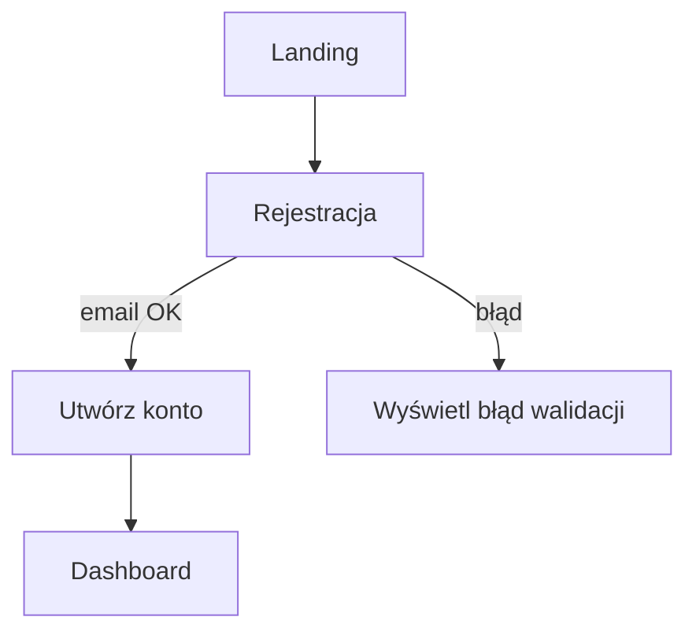
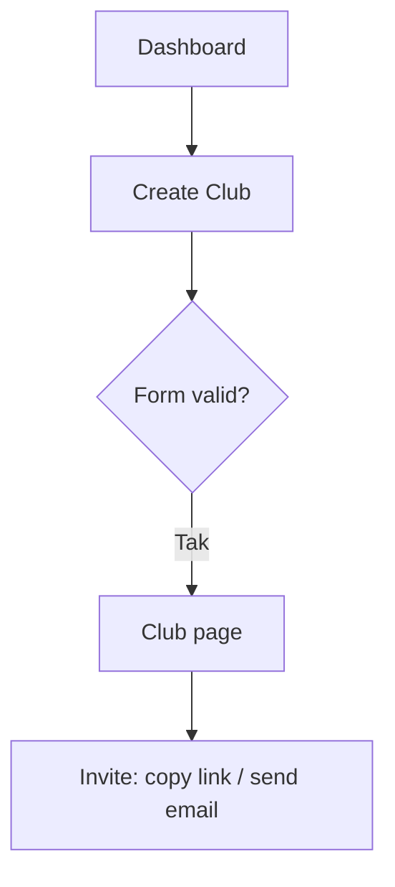
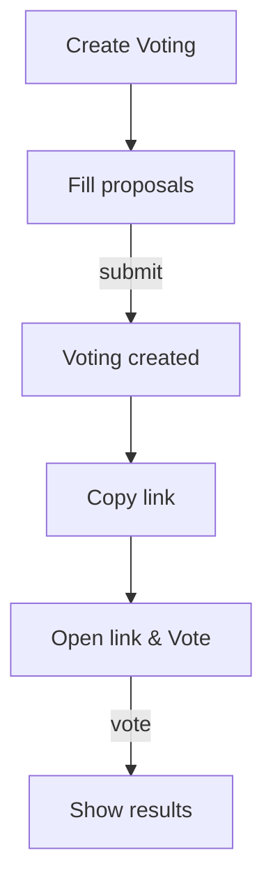

# Przepływy użytkownika — MVP BookClub Pro

## Persony (wyciąg z journey map)
- **Organizator** — zakłada klub, wysyła zaproszenia, tworzy głosowania i spotkania.
- **Członek** — dołącza przez link, głosuje, bierze udział w spotkaniach i dyskusjach.

---

## Flow 1 — Rejestracja / Logowanie (Sign-up)
**Cel:** szybkie utworzenie konta, wejście na dashboard.

**Skrócony opis:** Użytkownik z landing klika "Zarejestruj się" → email + password → automatyczne logowanie → dashboard.

**Szczegóły (kroki):**
1. Actor: Użytkownik → Action: Klika `Zarejestruj się` (Landing)
2. System: Wyświetl formularz `S002` → Actor: Wypełnia email i hasło
3. System: Walidacja → jeśli success → utwórz konto, loguj, redirect → Dashboard
4. Jeśli błąd walidacji → pokaż komunikat z instrukcją (microcopy `Sprawdź adres e‑mail`)

**Diagram (mermaid):**

**Alternatywy / błędy:**
- Email już istnieje → pokaz 'Masz już konto? Zaloguj się'.
- Słabe hasło → komunikat: "Hasło za krótkie (min 6 znaków)".

**MVP mapping:** wszystkie kroki są w zakresie MVP.

---

## Flow 2 — Utworzenie klubu i zaproszenia
**Cel:** Organizator tworzy klub i udostępnia link zaproszeniowy.

**Kroki:**
1. Actor: Organizator -> Action: Kliknij `Create Club` (S003)
2. System: Formularz nazwy klubu -> Actor: Wypełnia -> Submit
3. System: Tworzy klub -> redirect do Club Page (S004)
4. Actor: Organizator -> Action: Kliknij `Invite` -> System: pokaż link + opcja wysłania email

**Diagram (mermaid):**

**Edge cases:**
- Brak nazwy klubu → walidacja
- Błąd serwera -> retry + toast z instrukcją

---

## Flow 3 — Tworzenie głosowania i głosowanie
**Cel:** Stworzyć głosowanie na książkę i zebrać głosy.

**Kroki (happy path):**
1. Actor: Organizator -> Action: `Add Voting` (S005)
2. System: Wyświetl formularz; Actor: dodaje min. 2 propozycje
3. Submit -> System: utwórz głosowanie, pokaż link do udostępnienia
4. Członek -> Action: Otwiera public link -> oddaje głos -> System: zapisuje wynik

**Diagram (mermaid):**

**Alternatywy:**
- Głosowanie bez członków: allow creation, później dołączają.
- Jeśli głosują goście bez konta — zapisać identyfikator sesji lub anonimizować wyniki.

---

## Mapping do MVP (skrót)
| Flow | Critical? | MVP feature |
|------|----------:|-------------|
| Sign-up | Critical | Rejestracja (email+pass) |
| Create Club | Critical | Tworzenie klubu |
| Create Voting | Critical | Głosowania |
| Invite | Critical | Link do dołączenia |

---

## Acceptance criteria per flow
- Sign-up: użytkownik trafia na dashboard po poprawnej rejestracji (< 2 min).
- Create voting: po submit system zwraca link do udostępnienia i potwierdzenie sukcesu.
- Invite: link kopiuje się do schowka, działają adresy e‑mail.

## PYTANIA / NIEJASNOŚCI
1. Czy głosy z publicznego linku mają być przypisane do konta przy późniejszej rejestracji?
   - Opcje: A) przypisane po rejestracji; B) zostają anonimowe.
   - PROPOZYCJA: A — ułatwia konsolidację danych, ale wymaga mechanizmu merge.

## Źródła / Cytaty
- "Organizator zakłada klub i zaprasza członków" — docs/business/bookclub-pro-user-journey-map.md
- "Głosowania: Proste głosowanie TAK/NIE/ABSTAIN" — docs/business/bookclub-pro-mvp-scoping.md

## Gotowe do review?
- [ ] Każdy flow ma diagram mermaid
- [ ] Alternatywy i błędy opisane
- [ ] Acceptance criteria przypisane
